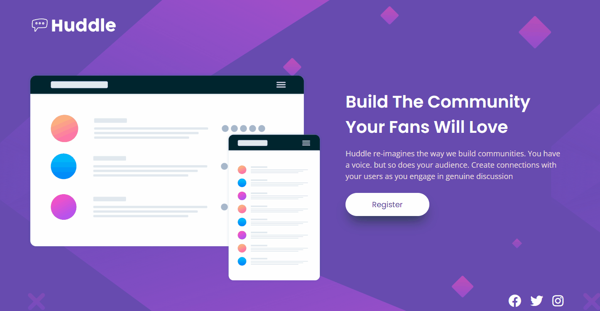

# Desafio DevQuest - Frontend Mentor

## 🚀 Desafio

    Esse foi um desafio proposto pelo curso DevQuest usando como base um projeto do Frontend Mentor.
    O projeto deveria ter um layout agradável para mobile e desktop e alguns elementos interativos 
    na página e não esquecendo de criar um código limpo e semântico.

## 🔖 Dificuldades

    As maiores dificuldades que enfrentei foi construir um  código semântico e limpo no HTML, 
    centralizar e posicionar alguns elementos com o CSS na tela. Mas no final conseguir contruir um site
    responsivo e bem semelhante ao layout original.  

## 🚀 O que eu aprendi

    Essa foi minha primeira landing page criada sozinho usando um layout do Frontend Mentor. 
    Entendi a impôrtancia de analisar e pensar no projeto antes de sair codando e organizar 
    todos os arquivos, variáveis, fontes, imagens e outros elementos que vão ser necessários 
    na contrução da página 

---

## 🔖 Construído com:

    -Marcação HTML5 semântico 
    -Flex-box 
    -pseudo-clase
    -responsivo
    -variáveis
    -font-awesome
    
---

## 🚀 Tecnologias utilizadas

    - HTML
    - CSS

---

    Desenvolvido por Matheus Macedo
